# Spoolman for Multi tools


## Prerequisites

### This does not integrate with any rfid tags, it's just spooolman.

### A working Spoolman instance

Spoolman is just a webapp, you don't need to have it runing on your printer, and in this case you wil need to host it somewhere else.
You can find instruction on how to install standalone [Spoolman](https://github.com/Donkie/Spoolman) on its [wiki](https://github.com/Donkie/Spoolman/wiki/Filament-Usage-History).
You can choose 2 differtn patsh:

- [docker](https://github.com/Donkie/Spoolman/wiki/Installation#docker-install): the easiets in my opinion
- or you can go nuts with pyton's delirium versions and dependencies and choose a [standalone](https://github.com/Donkie/Spoolman/wiki/Installation#standalone-install) path

### Unlocking the U1's advanced mode


### Your printer's IP:


### Download the [multi tool config file for spolman](spoolman_multi_tool.cfg)

## What to do:

### Access your U1's [Fluidd](https://docs.fluidd.xyz/) interface

Stick your printer's ip in a browser
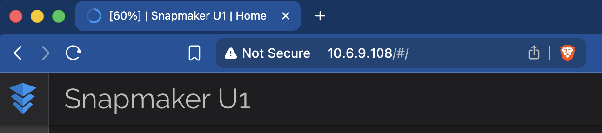

### Navigate to the config file page

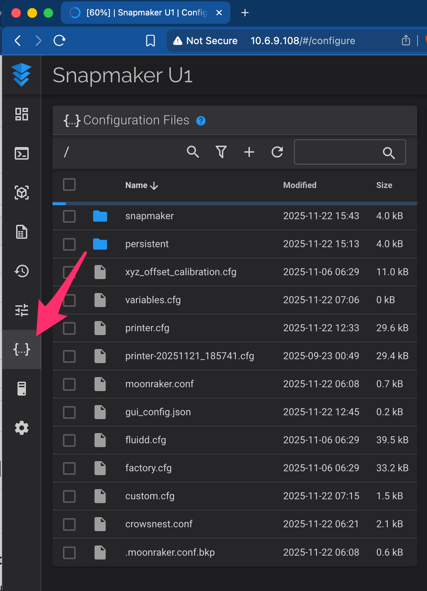

## Conect to Spoolman:

### Find your `moonraker.conf`

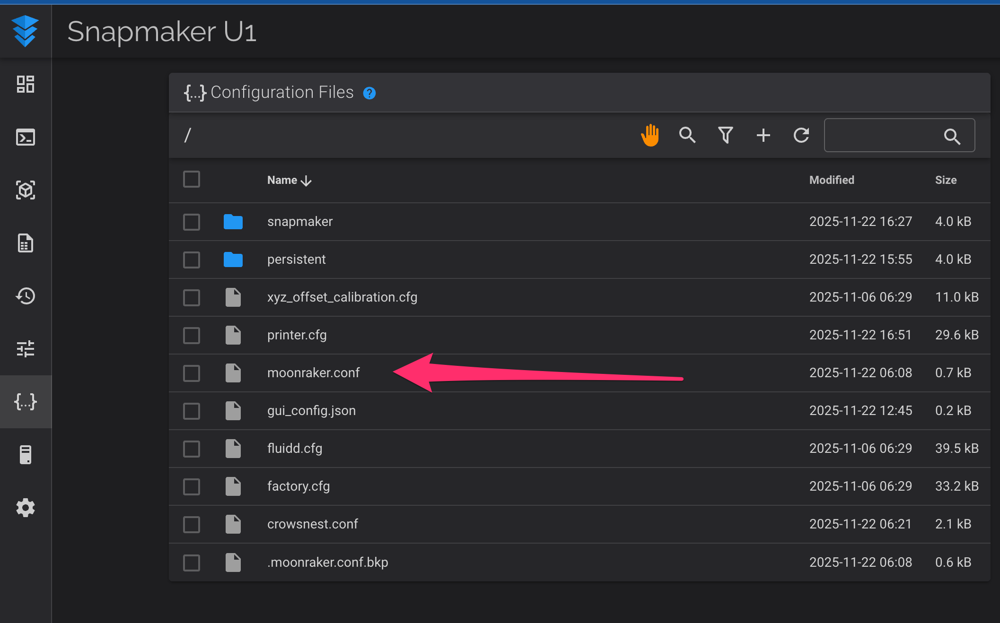

and append the spoolman connection to the end of the file

```
[spoolman]
server: http://<spoolman ip>:<port>
```


### Create the `custom` directory

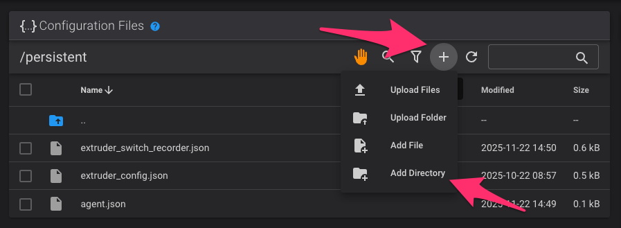
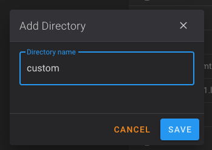

### Upload the `spoolman_multi_tool.cfg` file in the newly created `custom` directory

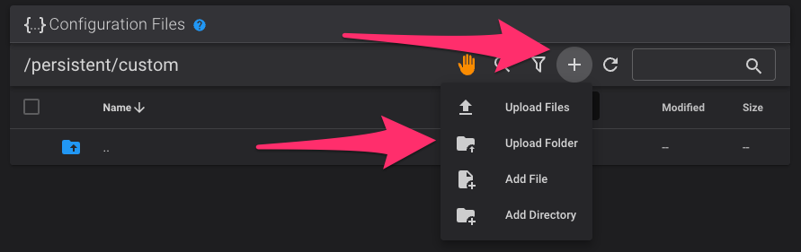
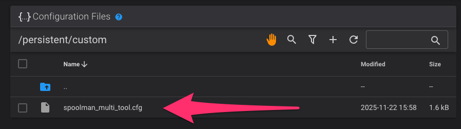

### Create variable persistence file

Create a file called `variables.cfg` int he config root
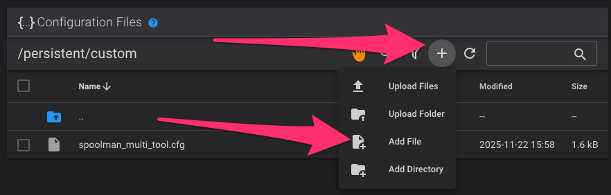
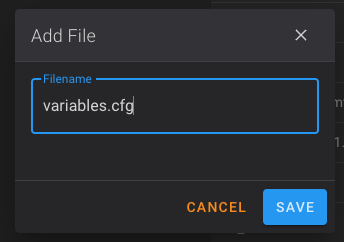
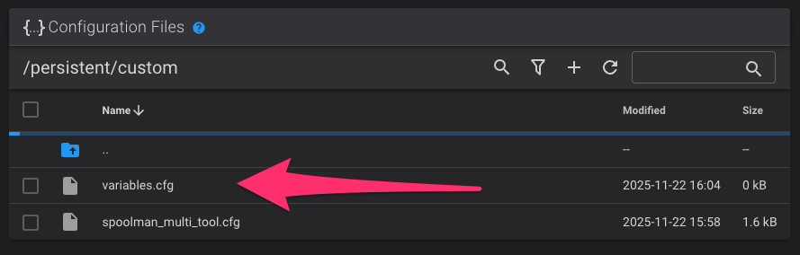

### Inlcude the new file in your `printer.cfg`

Copy the inlcude line form [multi tool config file for spolman](additions_to_printer.cfg)
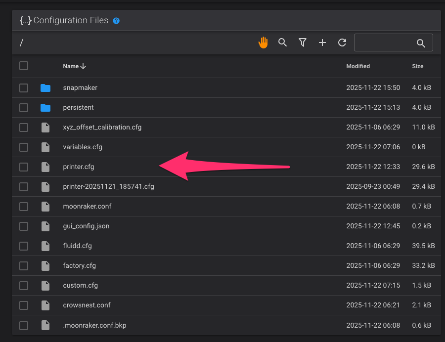
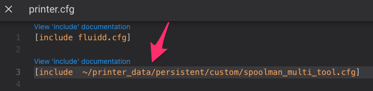

### Restart Klipper


### Activate Spoolman Pannel

From Fluidd's main page, open the `3 dots menu`, and select `Adjust dashboard layout`

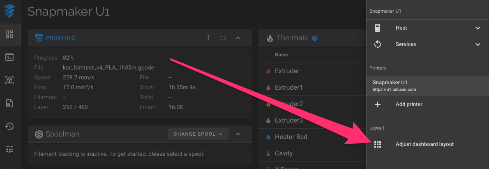

find the spoolman pannel and verify it is active
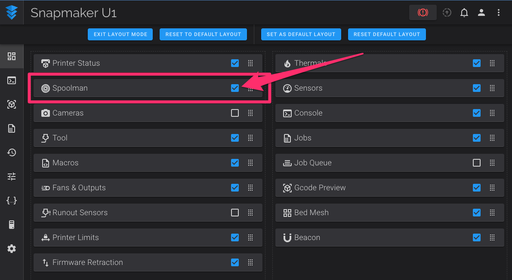
!!! PAY ATTENTION !!!: I reorganized my fuidd's pannel as it please me, so your spoolman panel might not be in the same position as mine. Look for it.

## Done:

Congrats, you can now asign spoolman's spools to your tools
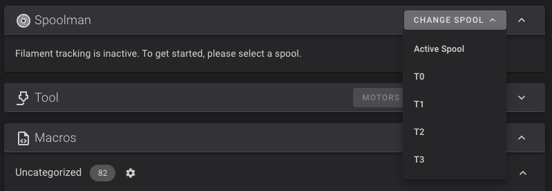

```

```
